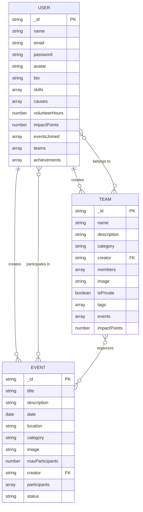
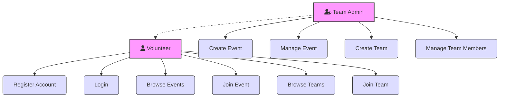
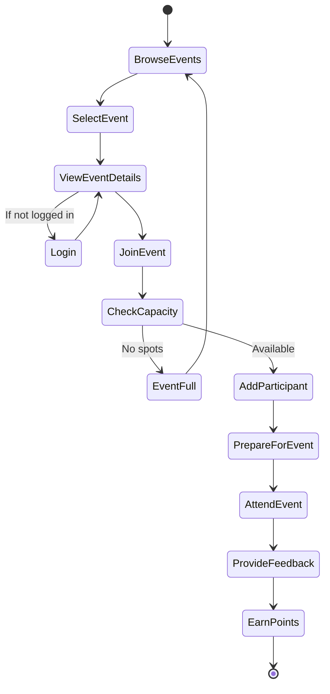

# 🌟 HandsOn Volunteering Platform 🌟

<div align="center">
  
  
  
  
  
  

  <p><i>Connecting hearts 💕, building communities 🏘️, creating impact 🌎</i></p>
  
</div>

<p align="center">
  <a href="#-key-features">Features</a> •
  <a href="#-quick-start">Quick Start</a> •
  <a href="#-api-reference">API</a> •
  <a href="#-system-diagrams">Diagrams</a> •
  <a href="#-license">License</a>
</p>

---

## ✨ Key Features

- 🔐 **Secure Authentication**: Register, login, reset password with email verification
- 👥 **Team Collaboration**: Create & join teams, manage roles, track collective impact
- 📅 **Event Management**: Organize events, manage participants, collect feedback
- 📊 **Impact Dashboard**: Track volunteer hours, impact points & achievements
- 📱 **Fully Responsive**: Beautiful UI across all devices
- 🏆 **Gamification**: Earn badges & points for volunteering activities
- 📸 **Media Sharing**: Upload photos from events and share experiences

---

## 🚀 Quick Start

### Prerequisites

- 📦 Node.js (v14+)
- 💾 MongoDB
- 📡 npm or yarn

### Installation

<details>
<summary>🔽 Click to expand installation steps</summary>

#### 1️⃣ Clone the repository
```bash
git clone https://github.com/yourusername/handson-platform.git
cd handson-platform
```

#### 2️⃣ Backend Setup
```bash
cd backend
npm install

# Configure environment variables
cp .env.example .env
# Edit .env with your values

# Start development server
npm run dev
```

#### 3️⃣ Frontend Setup
```bash
cd frontend
npm install

# Configure environment variables
cp .env.example .env.local
# Edit .env.local with your values

# Start development server
npm run dev
```

</details>

### 📝 Environment Variables

<details>
<summary>🔽 Backend (.env)</summary>

```
PORT=5000
MONGODB_URI=your_mongodb_uri
JWT_SECRET=your_jwt_secret
SMTP_HOST=smtp.gmail.com
SMTP_PORT=587
SMTP_SECURE=false
SMTP_USER=your_email@gmail.com
SMTP_PASSWORD=your_app_password
FROM_NAME=HandsOn Volunteering
FROM_EMAIL=your_email@gmail.com
FRONTEND_URL=http://localhost:3000
```

</details>

<details>
<summary>🔽 Frontend (.env.local)</summary>

```
NEXT_PUBLIC_API_URL=http://localhost:5000
NEXT_PUBLIC_CLOUDINARY_CLOUD_NAME=your_cloudinary_cloud_name
NEXT_PUBLIC_CLOUDINARY_UPLOAD_PRESET=your_upload_preset
```

</details>

---

## 📡 API Reference

### 🔐 Authentication API

| Method | Endpoint                | Description                       | Auth Required |
|--------|-------------------------|-----------------------------------|---------------|
| POST   | `/api/auth/register`    | 📝 Register a new user            | No            |
| POST   | `/api/auth/login`       | 🔑 Login a user                   | No            |
| GET    | `/api/auth/verify-email`| ✅ Verify user email              | No            |
| POST   | `/api/auth/forgot-password` | 🔄 Request password reset     | No            |
| PUT    | `/api/auth/reset-password` | 🔄 Reset password              | No            |
| GET    | `/api/auth/me`          | 👤 Get current user profile       | Yes           |
| PUT    | `/api/auth/update-details` | ✏️ Update user details         | Yes           |
| PUT    | `/api/auth/update-password` | 🔒 Update user password       | Yes           |
| GET    | `/api/auth/logout`      | 🚪 Logout user                    | Yes           |

### 👥 Teams API

| Method | Endpoint                   | Description                    | Auth Required |
|--------|----------------------------|--------------------------------|---------------|
| POST   | `/api/teams`               | 🛠️ Create a new team           | Yes           |
| GET    | `/api/teams`               | 🔍 Get all teams               | No            |
| GET    | `/api/teams/:id`           | 🔎 Get a single team           | No            |
| PUT    | `/api/teams/:id`           | ✏️ Update a team               | Yes           |
| DELETE | `/api/teams/:id`           | 🗑️ Delete a team               | Yes           |
| POST   | `/api/teams/:id/join`      | ➕ Join a team                 | Yes           |
| POST   | `/api/teams/:id/leave`     | ➖ Leave a team                | Yes           |
| PUT    | `/api/teams/:id/members/:userId` | 👑 Update member role    | Yes           |

### 📅 Events API

| Method | Endpoint                   | Description                    | Auth Required |
|--------|----------------------------|--------------------------------|---------------|
| POST   | `/api/events`              | 🛠️ Create a new event          | Yes           |
| GET    | `/api/events`              | 🔍 Get all events              | No            |
| GET    | `/api/events/:id`          | 🔎 Get a single event          | No            |
| PUT    | `/api/events/:id`          | ✏️ Update an event             | Yes           |
| DELETE | `/api/events/:id`          | 🗑️ Delete an event             | Yes           |
| POST   | `/api/events/:id/join`     | 🤝 Join an event               | Yes           |
| GET    | `/api/events/user/me`      | 👤 Get events by user          | Yes           |
| POST   | `/api/events/:id/feedback` | ⭐ Add event feedback          | Yes           |

---

## 📊 System Diagrams

<details open>
<summary>🔽 Entity-Relationship Diagram</summary>



</details>

<details>
<summary>🔽 Use Case Diagram</summary>



</details>

<details>
<summary>🔽 Activity Diagram</summary>



</details>

---

## 🛠️ Tech Stack

- **Frontend**: React, Next.js, Tailwind CSS, Framer Motion
- **Backend**: Node.js, Express.js, MongoDB
- **Authentication**: JWT, bcrypt
- **Email**: Nodemailer
- **File Upload**: Cloudinary

---

## 🤝 Contributing

Contributions are always welcome! 

1. 🍴 Fork the repository
2. 🌿 Create your feature branch (`git checkout -b feature/amazing-feature`)
3. 💾 Commit your changes (`git commit -m 'Add some amazing feature'`)
4. 📤 Push to the branch (`git push origin feature/amazing-feature`)
5. 🔃 Open a Pull Request

---

## 📄 License

This project is licensed under the MIT License - see the [LICENSE](LICENSE) file for details.

---

## 📞 Contact

📧 [tamim11903060@gmail.com](mailto:tamim11903060@gmail.com)

🔗 [GitHub Profile](https://github.com/tamim-18)

---

<div align="center">
  
  ### 🌱 Made with ❤️ by volunteers for volunteers 🌱
  
  
  
</div>
